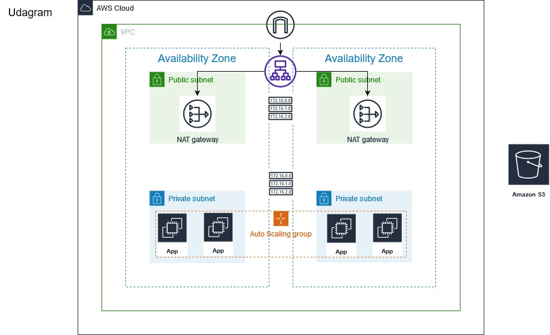

## Udagram - Deploy a high-availability web app using CloudFormation

### Scenario
- Your company is creating an Instagram clone called Udagram.
Developers want to deploy a new application to the AWS infrastructure.
You have been tasked with provisioning the required infrastructure and deploying a dummy application, along with the necessary supporting software.
This needs to be automated so that the infrastructure can be discarded as soon as the testing team finishes their tests and gathers their results.

### Udagarm Architecture :

- 


## Main Files: Project Structure

  ```
  ├── README.md
  |
  ├── udagram-network-params.json       ==> parameters passed for the network cfn stack
  |
  ├── udagram-network.yml               ==> yaml for network resources needed for deployment
  |
  ├── udagram-servers-params.json       ==> parameters passed for the servers cfn stack
  |
  ├── udagram-servers.yml               ==> yaml for servers resources needed for deployment
  |
  └── shell-scripts                     ==> directory included scripts for create/update/delete stacks
      |
      └── *.sh
  ```

## How To Deploy :
1. Run the create shell script for network stack
    ```sh
    $ ./shell-scripts/create.sh udagram-network udagram-network.yml udagram-network-params.json
    ```

2. Run the create shell script for servers stack
    ```sh
    $ ./shell-scripts/create udagram-servers udagram-servers.yml udagram-servers-params.json
    ```
